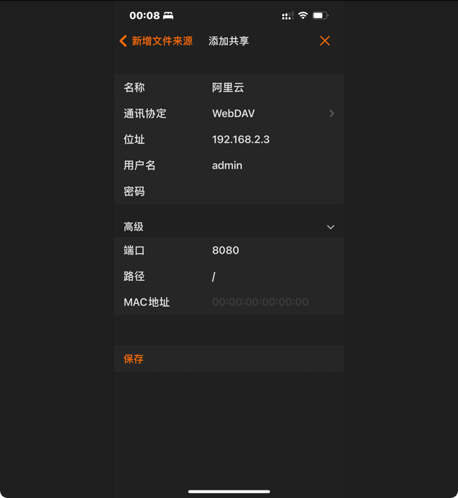
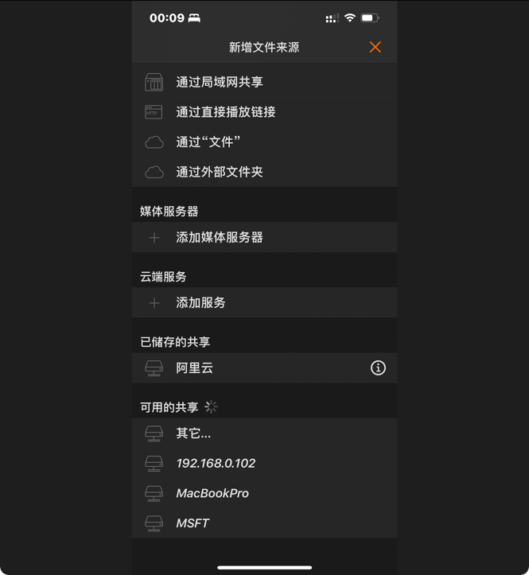
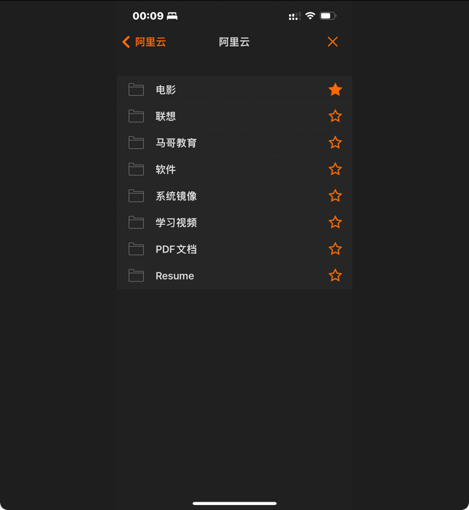
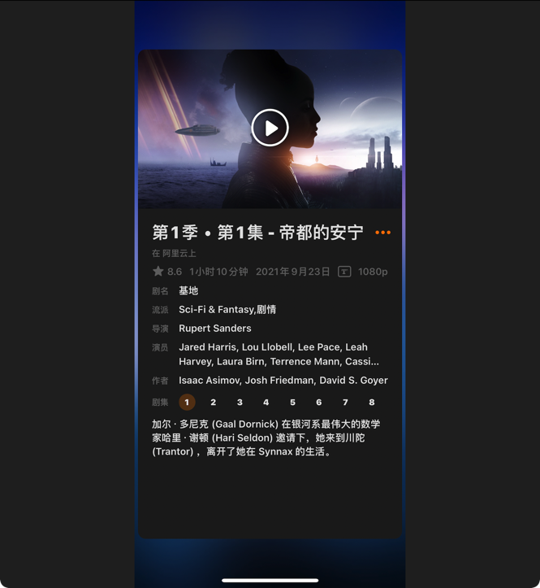

# aliyundrive-webdav

#### Reference:

https://github.com/messense/aliyundrive-webdav
https://github.com/zxbu/webdav-aliyundriver
#### Server:

Run with Docker

```shell
docker run -d --name=aliyundrive-webdav --restart=unless-stopped -p 8080:8080 \
  -v /etc/aliyundrive-webdav/:/etc/aliyundrive-webdav/ \
  -e REFRESH_TOKEN='your refresh token' \
  -e WEBDAV_AUTH_USER=admin \
  -e WEBDAV_AUTH_PASSWORD=admin \
  messense/aliyundrive-webdav
```

```shell
[root@msft /mdata/web/aliyundrive-webdav]# docker ps | grep aliyundrive-webdav
8af6d50fcb9b   messense/aliyundrive-webdav   "/sbin/tini -- /usr/…"   About an hour ago   Up About an hour   0.0.0.0:8080->8080/tcp, :::8080->8080/tcp                                                                  aliyundrive-webdav
```

#### Client :

Connect with Any Apps Support with WebDAV Protocol like: `Infuse Pro` on Any Devices

Take `Apple TV` & `iPhone` & `iPad ` for Example:









