#### RaspberryPI 4B with Openwrt 

> Reference
>
> https://github.com/immortalwrt/immortalwrt
>
> https://github.com/SuLingGG/OpenWrt-Rpi

First let's get started:

- Download the openWRT image for My 4B model

  [immortalwrt-bcm27xx-bcm2711-rpi-4-ext4-factory.img.gz](https://openwrt.cc/releases/targets/bcm27xx/bcm2711/immortalwrt-bcm27xx-bcm2711-rpi-4-ext4-factory.img.gz)

- Then burn the image to SD card with below Tool

  https://www.balena.io/etcher/

- Boot up the device and connect PI with your PC(wire or PI Wi-Fi (`OpenWrt`))

- Login the PI managed IP with default http://192.168.1.1 and default passwd `password`

- Then let's configure our device :

  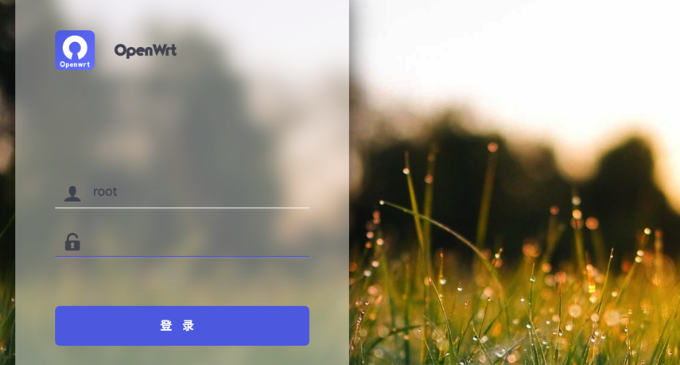

​		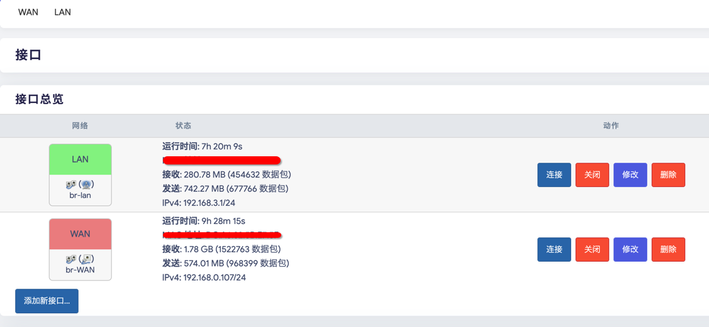

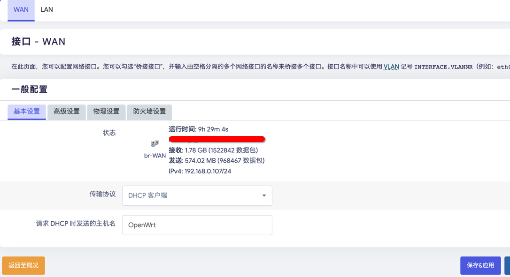

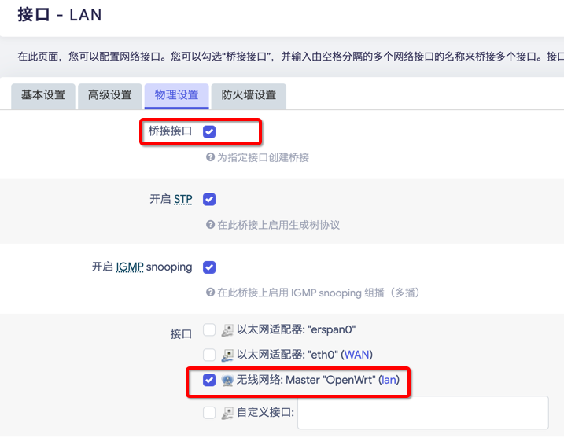

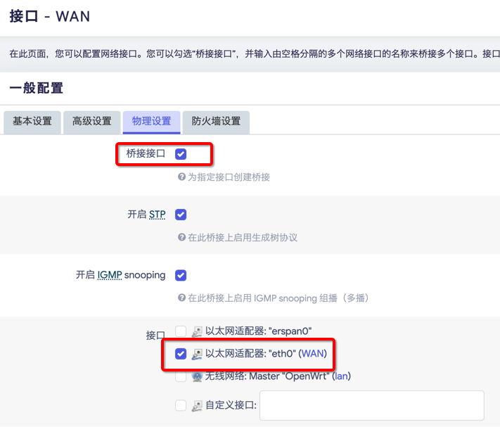

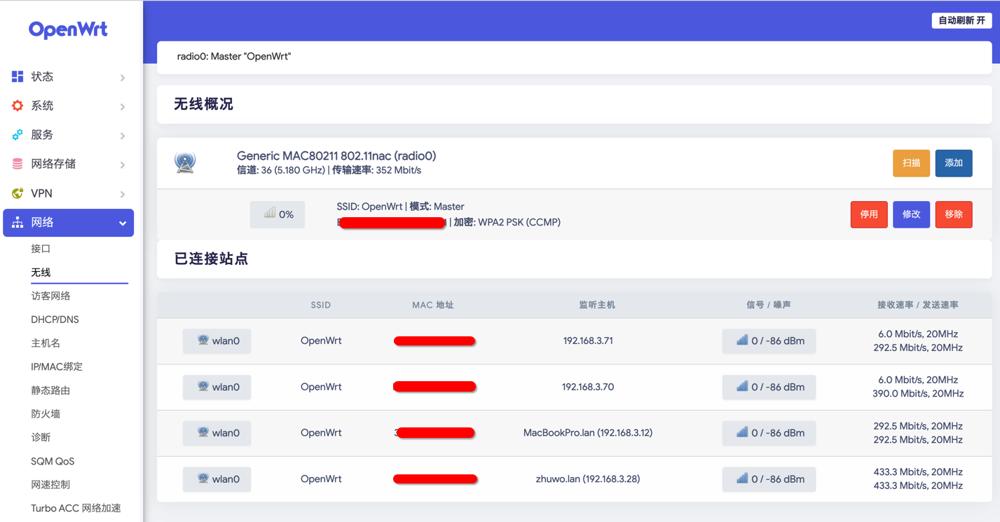

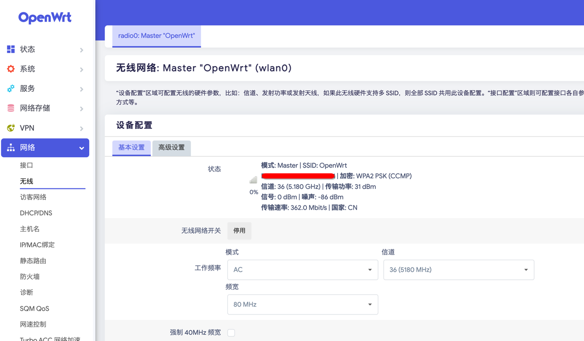

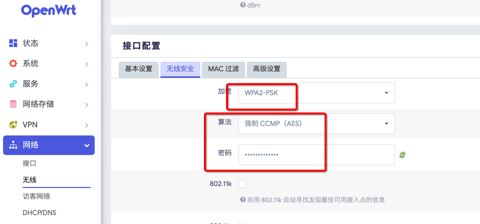

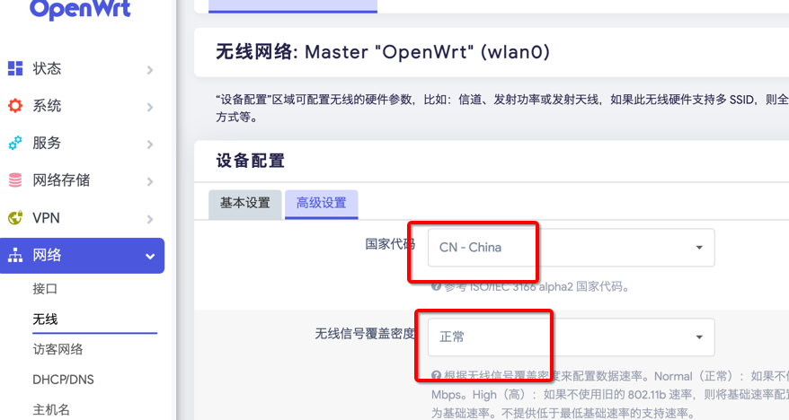

After above settings disconnect wire connect with your PC, You should be able to connect to your WIFi OpenWrt with password just set.

> **As Main router**

You just have to change `WAN` Interface protocol to `PPPoE` then connect your PI with network user Account and password.

> **AS Second router**

You just set all the things just like me above, then connect PI `WAN Interface`with main router `LAN Interface`,Then PI will get an DHCP IP address from Main router , just like mine `192.168.0.107`

Then enjoy the high speed Internet. Above just the  basically settings for your guys. If you want to explore more, I will shoot you some examples below and Have Fun.

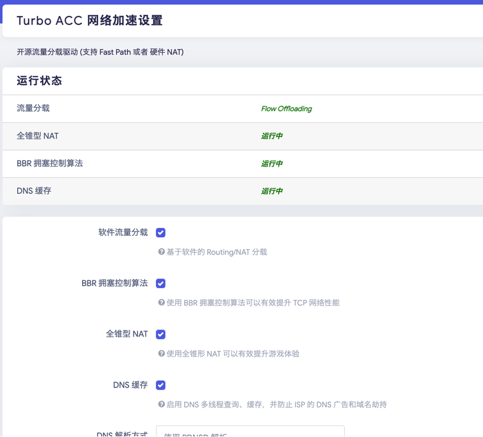

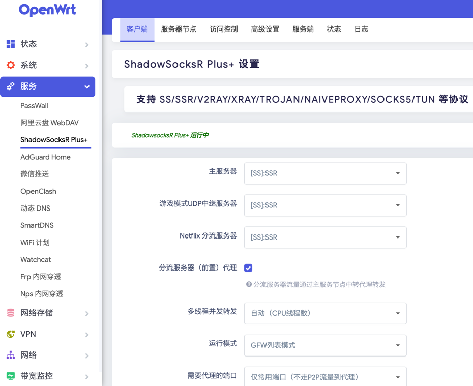

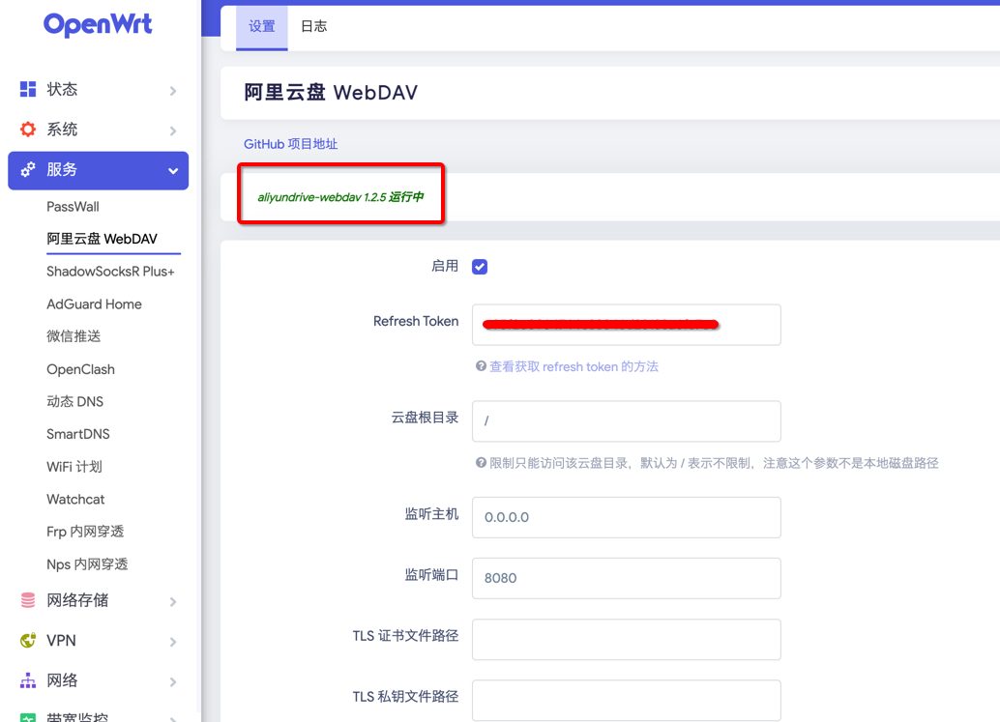

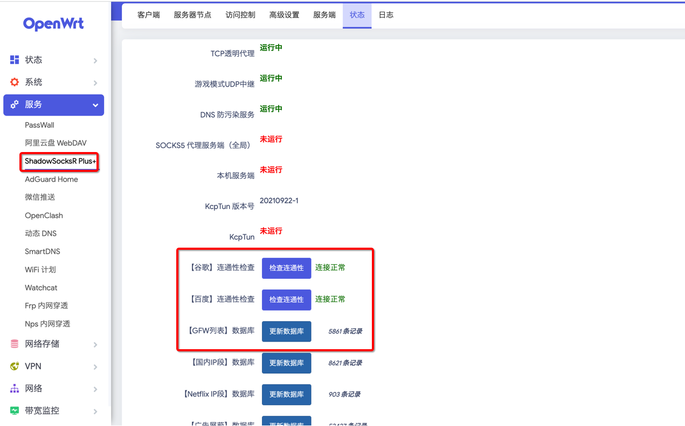

