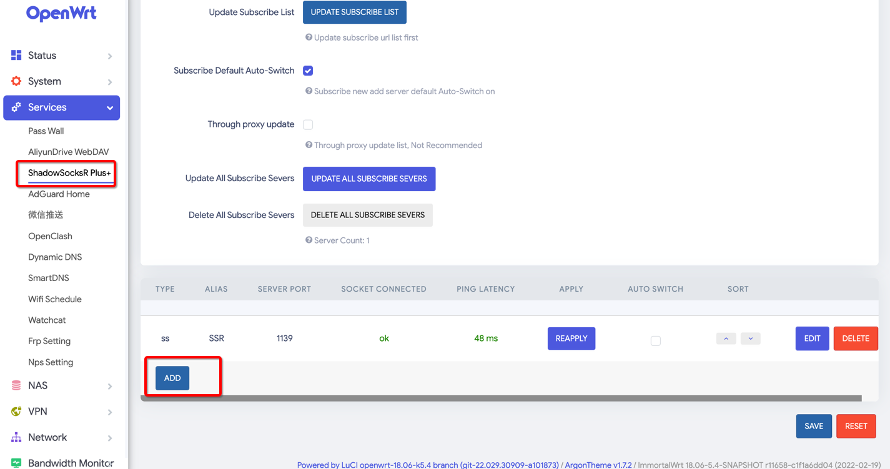
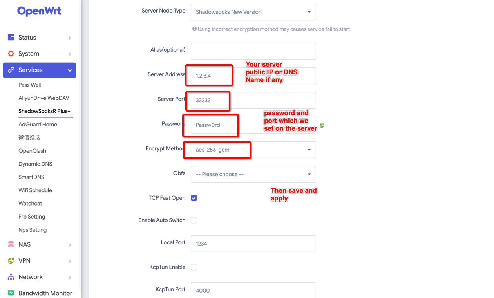
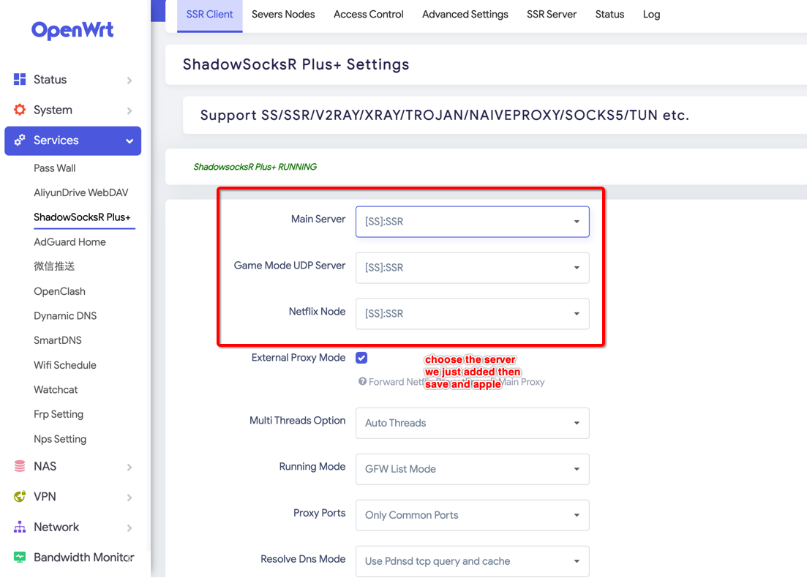

#####  SSR+OpenWRT

> Well , You know Sometime for some reason you need to browser like a Google like GitHub, well, I think here is a solution for you and they're pretty stable right now.

Let's get started:

- Prepare a VPS Server on your own, I think I will skip this step.

- I assume you've already have a VPS and you've login into it:

  ```bash
  # install docker
  curl -fSsL get.docker.com |CHANNEL=stable sh
  # start docker and enable it
  systemctl start docker && systemctl enable docker
  # do some preparation work
  mkdir /etc/shadowsocks 
  cat >/etc/shadowsocks<<EOF
  {
      "server":"0.0.0.0",
      "server_port":33333,   # Port which you client can access to
      "password":"Passw0rd", # Client password to connect to this server
      "timeout":300,   # connection timeout setting
      "method":"aes-256-gcm",  # encryption protocol
      "fast_open":false,
      "mode":"tcp_and_udp"
  }
  EOF
  # run your own application with docker
  docker run -d \
  	-p 1139:1139/tcp \
  	-p 1139:1139/udp \
  	--name ssr \
  	-v /etc/shadowsocks:/etc/shadowsocks-libev \
  	--restart=always \
  	appso/shadowsocks-libev
  # Check your ssr application
  [root@centos ~]# docker ps | grep ssr
  427a25800353   appso/shadowsocks-libev        "ss-server -c /etc/s…"   11 hours ago   Up 11 hours             0.0.0.0:1139->1139/tcp, 0.0.0.0:1139->1139/udp, :::1139->1139/tcp, :::1139->1139/udp   ssr
  # Firewalld and selinux(only rhel or centos)
  [root@centos ~]# sestatus 
  SELinux status:                 disabled
  [root@centos ~]# systemctl status firewalld.service 
  ● firewalld.service
     Loaded: masked (/dev/null; bad)
     Active: inactive (dead)
  # cloud server network rule opens for the port we just set 33333
  ```

- After above  steps your server side is complete now.

- Configuration clients:

  - And there are many configuration clients for the server, but we don't want use any clients for devices, we are using our router as clients then we can access now the remote network, and `OpenWRT` is what  we're looking for , since I've already done configurations with OpenWRT Device. Let's jump to the configuration part on OpenWRT.

    

    

    

- Then connect to your PI WIFI to check network accessible to Google.com, Good Luck ~
